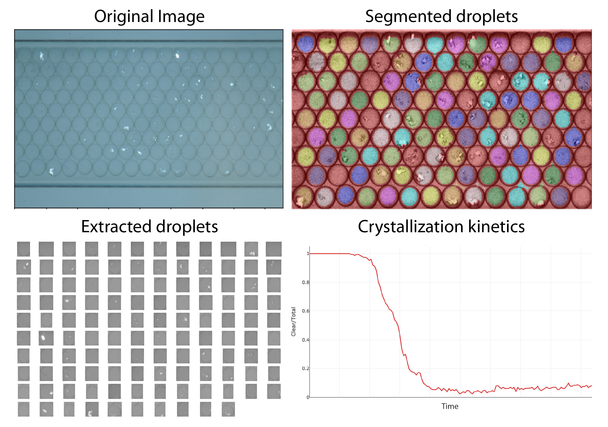

# CrystalML

[](https://badge.fury.io/py/crystalml)
[](https://travis-ci.com/hlgirard/CrystalML/branches)
[](https://github.com/hlgirard/CrystalML/blob/master/LICENSE)

**Disclaimer:** This program is undergoing active development and should _not_ be used for production. All APIs and commands are susceptible to change without notice.

Integrated tool to measure the nucleation rate of protein crystals from the crystallization kinetics of an array of independent identical droplets.

From a directory containing a time-series of images of mutliple droplets, the tool segments individual droplet and uses a pre-trained CNN model to determine the presence or absence of crystals in each drop.
The nucleation rate is evaluated from the rate of decay of the proportion of drops that _do not_ exhibit visible crystals.



## Installation

### Install with pip

CrystalML is on PyPI so it can be installed with pip

```
pip install crystalml
```

### Install from source

Clone the repository to your computer

```
git clone https://github.com/hlgirard/CrystalML.git
```

and install with pip 

```
cd CrystalML
pip install .
```

## Usage

### Quickstart

A time series of images of an emulsion of protein-ladden droplets must be stored in a directory prior to usage of CrystalML
The application can then be used to process the images as follows:
```
crystalml process --save-plot path/to/directory
```

### `crystalml process` command

The `process` command takes a directory of images, segments the droplets in each image and determines how many droplets are present and how many of these contain crystals.
The program saves a `.csv` file at the root of that directory with the name of each image, the time it was taken (from EXIF data) and the number of droplets (total, clear and containing crystals).

#### Arguments

- `-c`, `--check-segmentation` displays the result of segmenting an image (selected at approximately 80% of the time series) to verify that the segementation algorithm works well before processing.
- `-o`, `--save-overlay` resaves all images in the directory with an overlay showing detected droplets in red (no crystal) or green (crystal detected) for process control.
- `-p`, `--save-plot` generates and saves plots of crystal contents over time
- `-v`, `--verbose` increases the verbosity level

### `crystalml segment` command

The `segment` command runs the segmentation algorithm on an image or a directory of images and saves the segmented droplet images to disk.

#### Arguments

- `-o`, `--save-overlay` resaves all images in the directory with an overlay showing detected droplets
- `-v`, `--verbose` increases the verbosity level

### `crystalml train` command

The `train` command is used to train the machine learning models used to label the segmented droplets as containing crystals or not. A directory of training data is expected containing subdirectories named `Crystal` and `Clear` containing grayscale images of segmented droplets (use the `segment` command to generate the images).

#### Arguments

- `-m`, `--model` selects the type of model to train (svm|cnn|cnn-transfer)
- `-tb`, `--tensorboard` saves logs for tensorboard visualization in `<cwd>/logs`
- `-v`, `--verbose` increases the verbosity level

## Repository strutcture

- `models`: pre-trained machine learning models for crystal presence discrimination
- `notebooks`: jupyer notebooks evaluating different image segmentation strategies
- `src`: source code for the project
    - `crystal_processing`: processing pipeline from directory to nucleation rate
    - `data`: data processing methods, including cropping, segmentation, extraction
    - `models`: model definition and training scripts for the droplet binary labelling task
    - `visualization`: visualization and plotting methods
    - `cli.py`: entry point to the command line interface
- `tests`: unittesting

## License

This project is licensed under the GPLv3 License - see the [LICENSE.md](LICENSE.md) file for details.

## Credit

Initial models were built starting from the example at:
https://blog.keras.io/building-powerful-image-classification-models-using-very-little-data.html

Live data visualization class TrainingPlot originally from:
https://github.com/kapil-varshney/utilities/blob/master/training_plot/trainingplot.py
